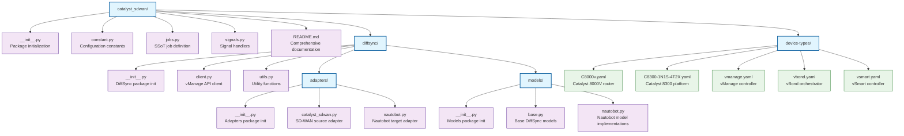

# Catalyst SD-WAN SSoT Integration - Implementation Summary

## Overview

I've created a complete Catalyst SD-WAN integration for the Nautobot SSoT app, following the established ACI integration pattern. This integration provides bi-directional synchronization between Cisco Catalyst SD-WAN (vManage) and Nautobot with DiffSync technology for intelligent updates.

## Created Files Structure



## Key Features Implemented

### 1. **DiffSync Models**

- **Tenant**: Global tenant for SD-WAN objects
- **VRF**: Maps SD-WAN VPNs to Nautobot VRFs
- **Device**: Comprehensive device model with SD-WAN specific attributes
- **Interface**: Interface model with VPN assignments and operational status
- **DeviceType**: Hardware models with interface templates
- **DeviceRole**: Maps SD-WAN personalities to roles
- **DeviceTemplate**: For tracking template assignments (extensible)

### 2. **vManage API Client** (`client.py`)

- Session-based authentication with XSRF token handling
- Comprehensive API endpoints for:
  - Device inventory (`/dataservice/device`)
  - Interface details (`/dataservice/device/interface`)
  - Template configurations (`/dataservice/template/*`)
  - VPN/VRF information
  - Site and topology data
- Robust error handling and retry logic
- SSL verification support

### 3. **Intelligent Adapters**

#### Catalyst SD-WAN Adapter (`catalyst_sdwan.py`)

- Loads devices, interfaces, VRFs, and templates from vManage
- Maps SD-WAN personalities to device roles:
  - `vmanage` → vmanage
  - `vbond` → vbond  
  - `vsmart` → vsmart
  - `vedge`/`cedge` → edge
- Interface type detection based on naming conventions
- VPN to VRF mapping with defaults for transport (0) and management (512) VPNs
- Device type auto-detection with YAML template support

#### Nautobot Adapter (`nautobot.py`)

- Loads existing SD-WAN objects from Nautobot
- Tag-based filtering for SD-WAN specific objects
- Custom field population for SD-WAN metadata
- Relationship management for complex objects

### 4. **Device Type Definitions**

Pre-configured YAML files for common SD-WAN devices:

- **C8000v**: Virtual edge router with 8 GigE interfaces
- **C8300-1N1S-4T2X**: Physical edge platform with mixed interfaces
- **vManage**: Management controller with basic connectivity
- **vBond**: Orchestrator with standard interfaces
- **vSmart**: Policy controller configuration

### 5. **Utility Functions** (`utils.py`)

- YAML device type loader
- Interface name normalization
- SD-WAN personality to role mapping
- Interface type determination
- Extensible for custom mappings

### 6. **SSoT Job Integration** (`jobs.py`)

- Complete job class `CatalystSdwanDataSource`
- Parameter validation for vManage controller and location
- Data mapping visualization
- Integration with Nautobot's job framework
- Debug logging support

## SD-WAN Specific Enhancements

### Custom Fields

The integration creates and populates custom fields for SD-WAN metadata:

**Device Fields:**

- `catalyst_sdwan_system_ip`: Overlay system IP
- `catalyst_sdwan_site_id`: SD-WAN site identifier
- `catalyst_sdwan_personality`: Controller type
- `catalyst_sdwan_reachability`: Connection status
- `catalyst_sdwan_device_model`: Specific hardware model
- `catalyst_sdwan_version`: Software version
- `catalyst_sdwan_uuid`: Unique device identifier

**Interface Fields:**

- `catalyst_sdwan_vpn_id`: VPN segment assignment
- `catalyst_sdwan_admin_status`: Administrative state
- `catalyst_sdwan_oper_status`: Operational state

### VPN/VRF Management

- Automatic VRF creation for discovered VPNs
- Standard VPN mappings (0=Transport, 512=Management)
- Namespace isolation for multi-tenancy
- Route distinguisher support

### Template Tracking

Foundation for tracking device template assignments:

- Template ID and name correlation
- Attachment status monitoring
- Configuration drift detection (extensible)

## Integration Patterns

### Following ACI Model

The implementation follows the established ACI integration patterns:

- Similar directory structure and file organization
- Consistent naming conventions and coding style
- Same DiffSync architecture and model relationships
- Compatible job parameter structure
- Unified error handling and logging

### DiffSync Benefits

- **Intelligent Updates**: Only changes what's different
- **Conflict Resolution**: Handles concurrent modifications
- **Rollback Capability**: Can revert changes if needed
- **Performance**: Efficient bulk operations
- **Auditability**: Complete change tracking

## Configuration Requirements

### Prerequisites

1. **Controller Object**: vManage controller in Nautobot
2. **External Integration**: With vManage credentials and SSL settings
3. **Managed Device Group**: For SD-WAN device organization
4. **Tags**: Required tags for object identification
5. **Custom Fields**: Automatically created during first run

### Settings

```python
PLUGINS_CONFIG["nautobot_ssot"] = {
    "catalyst_sdwan_tag": "catalyst_sdwan",
    "catalyst_sdwan_manufacturer_name": "Cisco", 
    "catalyst_sdwan_tenant_prefix": "Catalyst-SDWAN",
    "catalyst_sdwan_comments": "Imported from Catalyst SD-WAN",
}
```

## Usage Workflow

1. **Setup**: Configure vManage controller and credentials in Nautobot
2. **Job Execution**: Run `CatalystSdwanDataSource` job with parameters
3. **Synchronization**: DiffSync compares and updates objects
4. **Monitoring**: Review job logs and created/updated objects
5. **Maintenance**: Regular sync jobs to maintain consistency

## Extensibility

### Adding Device Types

1. Create YAML definition in `device-types/`
2. Define interfaces with types and management flags
3. Automatic interface template creation

### Custom Attributes

1. Add fields to DiffSync models
2. Update adapters to populate data
3. Extend API client for additional endpoints

### Template Integration

1. Enhance template model definitions
2. Add configuration comparison logic
3. Implement policy synchronization

## Benefits

### For Network Operations

- **Single Source of Truth**: Centralized SD-WAN inventory
- **Automated Documentation**: Self-maintaining device database
- **Change Tracking**: Historical record of modifications
- **Consistency**: Synchronized data across systems

### For Automation

- **API Access**: Nautobot REST API for all SD-WAN data
- **GraphQL**: Advanced querying capabilities
- **Webhooks**: Event-driven automation triggers
- **Integration**: Easy connection to other tools

### For Compliance

- **Audit Trail**: Complete change history
- **Configuration Drift**: Detection of unauthorized changes
- **Reporting**: Compliance status dashboards
- **Documentation**: Automated network documentation

This implementation provides a solid foundation for SD-WAN network management and can be extended to support additional features as requirements evolve.
